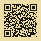

  

<h1 align="center">Scratch Pad</h1>

  <strong>Share your files, between your devices, with your friends.</strong> 
  Fast. Easy. Private. Free. No ads, no tracking, no data mining. Set it up once and go.

  
  
  
  

---

## 📱 Get it on your phone in 2 minutes

**No app store. No account to create. No download.** It's a web page that installs like an app.

**On your phone:**

1. Open **[scratch-ellovee-s-projects.vercel.app](https://scratch-ellovee-s-projects.vercel.app)** — or just point your camera at this code:

2. Tap your browser's menu and choose **"Add to Home Screen."**
   *(iPhone: use **Safari**, tap the **Share** box at the bottom. Android: use **Chrome**, tap the **⋮** menu.)*
3. Done — a **Scratch Pad** icon is now on your home screen. Tap it like any other app.

**To link it with your laptop (or a friend's phone):**

4. Open the same link there too (and "Add to Home Screen" there as well, if you like).
5. On each device, tap **connect**, type your email, and enter the code it emails you.
   *(Just once per device — you stay signed in after that.)*

That's the whole setup. Now anything you put on a card and **Save** shows up on your other devices in a couple of seconds. ✨

---

## The problem

You snap a photo on your phone and need it on your laptop. Or you want to hand a note — a video, a file — to a friend standing right next to you. Today that means emailing it to yourself, signing into somebody's cloud, hunting for a cable, or installing one more app that wants your contacts.

It should be as easy as **writing it on a card and sliding it across the desk.**

## What it is

**Scratch Pad is a shared paper desk that lives on all your devices at once.** One big index card and three small ones. Drop in text, photos, videos, files, or links — and a second or two later it's on your other device too. Want to give a card to someone who doesn't have the app? Show them a **QR code** — they open it in any browser. No account, no install, nothing to sign.

Everything saves the moment you write it, right on the device, and mirrors to the rest. It looks like a 1950s library card catalog and works like a quiet little magic trick.

## What it does

- 🔄 **Cross-device sync** — write on your phone, see it on your laptop in about two seconds. And the reverse.
- 🖊️ **Just write** — every card is editable; tap **Save** to commit. Whatever you save last wins, cleanly.
- 📎 **Anything fits** — text, images, video (plays inline), files, and web/video links (YouTube & Vimeo embed).
- 🎤 **Dictate** — talk, and it types.
- ▦ **QR share** — hand any card to anyone with a scannable code; they get a clean, read-only page. No login.
- 📱 **It's an app** — add it to your home screen and it runs full-screen with its own icon.
- ⚡ **Local-first** — instant, works offline, catches up when you're back.

## Privacy, honestly

- **No ads. No trackers. No analytics. No data mining.** Nobody is watching you here.
- Your board is **local-first** — it lives on your device and loads instantly, even offline.
- To move things between your devices it uses a **minimal free backend** (Supabase), where your board is locked to your account. It's a quiet pipe between your own devices — not a profile to be sold.
- Shared cards live at an **unguessable private link** that only works if you choose to hand it out.

(So: not "no servers ever" — but no surveillance, no ads, and nothing about you for sale. That's the honest version.)

## Support the project

Scratch Pad is **free, and always will be** — no subscriptions, no upsells, no asterisks. It's built and looked after by one person. If it saved you a headache and you'd like to chip in, it genuinely helps — and is deeply appreciated:

- ☕ **Buy Me a Coffee** — [buymeacoffee.com/aSchellCompany](https://buymeacoffee.com/aSchellCompany)
- 💵 **Cash App** — `$Aircityryan`
- ₿ **Bitcoin** — `bc1q4q0u5f7ya3ylwg3h4sdq5yw7cgfpl4ghpu9uap`
- ⓜ **Monero** — `4B3RLHnNS6tNeHEneTXcecTAntHknXzbLYR1yBP3yUWS9baUjdnHv4UdhjRubaSexuPGEGmJ4QKpxHdrHNjLMuZpHf15gUt`

No pressure, ever. Using it and telling a friend is support too. 🤎

## Under the hood

- **Next.js** (App Router) · **React** · **TypeScript** · **Tailwind CSS**
- **Supabase** (free tier) for sign-in, cross-device sync, and media storage
- Installable **PWA**, deployed on **Vercel**
- Local media copies in **IndexedDB**; QR codes generated on-device

## License

[MIT](LICENSE) — do what you like with it.

---

<em>Built with care — and a lot of joy — by Ryan, in partnership with Claude.</em>

